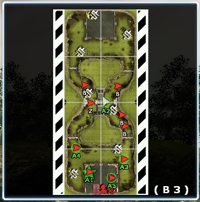

We're happy to announce version 2.34.3 is live on Steam.


<iframe src="https://store.steampowered.com/widget/17740/" frameborder="0" width="646" height="190"></iframe>


Join us on Discord! https://discord.gg/EXwY2X7

Changelog:

## Features

- Added a squad member ID to both the mini-map and the Squad HUD. This can be used to locate specific players.
- Added player requests to the squad HUD. (Ammo/Health/Repairs)
- Added an indicator in the Squad HUD for players receiving the squad aura effect. (Green box next to player health when player is receiving the benefit of the squad aura.)

| Squad HUD changes | Mini-map changes |
|---|---|
|  and an indicator for players currently receiving the squad aura effect.") |  |

## Bug fixes

- Fixed an issue causing explosion damage to break completely on vehicles. This was caused by a previous version, some of the explosion code was rewritten to fix a bug involving a tank's turret entity transferring damage to the tank entity. There was an oversight which was causing the damage to be prevented entirely; it should now be fixed.

## Script/Game Balance

### Infantry Resistances

- Reduced Explosive Missile Resistance (Nuclear Warhead) for all classes
	- Grenadier with Health Upgrade can no longer survive a direct nuclear missile hit
- Reduced Artillery resistance for all classes
	- Grenadier with Health Upgrade can no longer survive a direct high-explosive artillery shell hit.
	
### Research
- Plasma Heavy Machine Gun
	- Reduced Time from 90 to 60
	- Reduced Cost from 360 to 240