### Project Focus and Projectiles

###### Roy Awesome

Most of July was spent trying to network the ECS projectiles.  We got pretty far, creating a network transport layer and defining the base protocol to replicate bullets, but we got bogged down packaging the bullets and sending them across the wire to remote clients.  After a few weeks of fighting with the Engine, late in July we decided to shelve ECS bullets for now, and approach it again when the project is further along.  We have a working projectile system, so it would be best to focus our efforts on things that don’t exist, like Vehicles and Buildings.  Also, Mayama creating a ton of amazing vehicles helped us realize we needed to start getting them in game sooner rather than later.

I also spent some time this month cleaning up our project organization system with Deif.  With ECS Projectiles backlogged, we need to fix a few more bugs and the milestone is complete.  Next we’ll focus on Buildings and Vehicles, and start to get this game into a more complete state.

### Projectile Stuff

###### Megafunk

I gave a cursory attempt to implement bullet penetration in the ECS projectiles plugin. Lots of surprisingly simple math involved. The tough part is considering what happens if a projectile goes through multiple things in a single frame, or whether it should penetrate or bounce off. I’ll need to rearrange some things to account for weird edge cases like that.

### Vehicle Design

###### Mayama

Hi again, this month I managed to finish the BE vehicles and do some “extra work”.

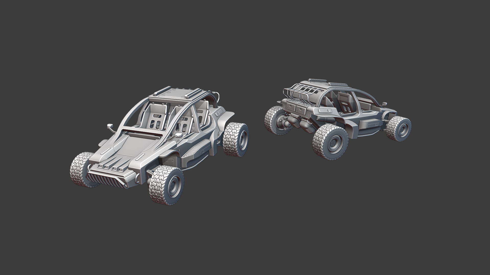

The Brenodi Jeep. It’s lower than the NF counterpart and the people in the second row aren't as exposed as they are in the NF version. The downside is that it’s way harder to shoot from the back seats. Is that balanced? We don't know, we have to see. At least in source empires jeeps are usually not that problematic that small imbalances like that turn out to be an issue. You can see that BE is way more high tech than NF because the car has rear view mirrors.

The BE APC. The Idea behind the vehicle is that it's also used to fight riots and similar problems in cities. The Brenodi Empire has to deal with such problems on a daily basis especially in the outer regions. So there's no real difference between military operations and police work.

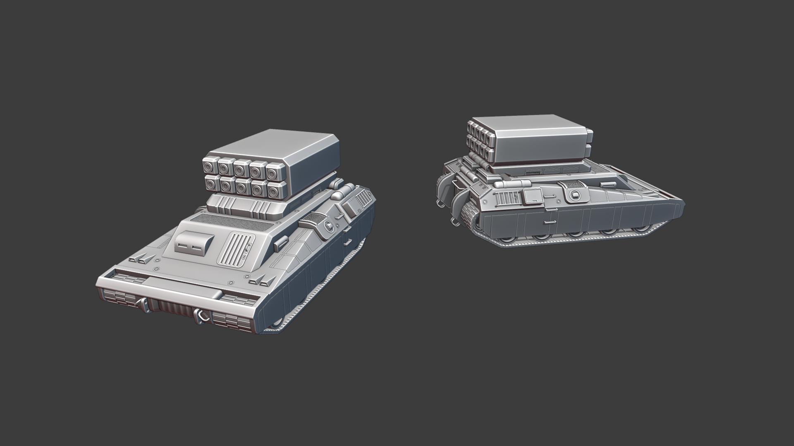

The BE artillery platform. Like its NF counterpart it's a multipurpose platform. I made a rocket artillery because it feels more modern than big clunky cannons. The rockets are more or less just a visual, it's still firing things in an arc at a location you cannot see.

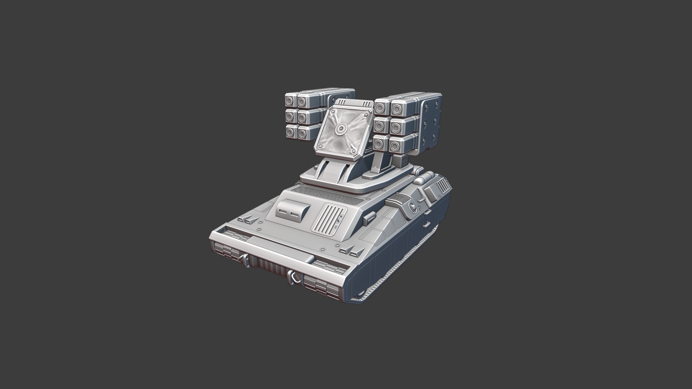

Here's an example of how the vehicle could look like with another weapon mounted on its platform. It's an anti aircraft turret. The deformations in the middle are folds of the fabric that covers the radar. It's maybe a bit hard to see without textures.

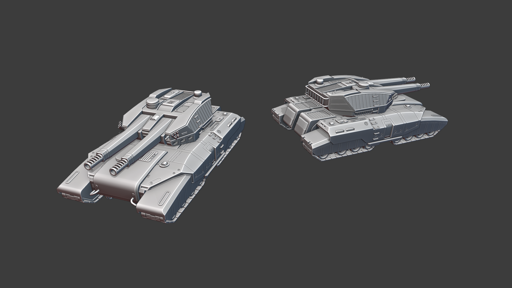

The BE Heavy Tank. It's the biggest mass produced tank in the Brenodi arsenal. As you can see it still has its signature dual barrel turret. It's a bit broader but not as high as the NF equivalent. 

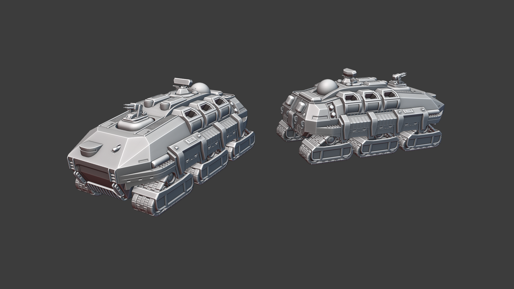

Last but not least the BE Command Vehicle. A behemoth like the NF counterpart towering above all else sending out the orders of the commander to its subordinates.

Here are some pics so you can get a feeling about the size difference between the vehicles:

You might notice that the BE light tank has a new turret and the medium has some extra detail compared to the pics of last month.

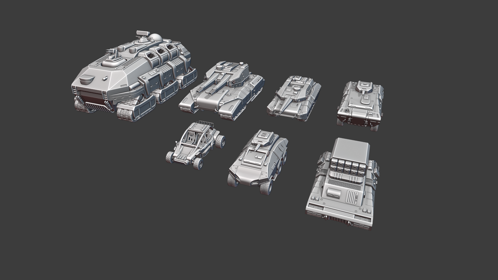

So about the extra work...

I managed to low poly and texture some of the vehicles. Keep in mind that the textures are really really “work in progress” and not finished at all, every vehicle only uses one 4k texture map right now so it's also not that high res. The symbol on the BE medium tank is just a placeholder for the new BE symbol that we still have to figure out. The team's favourite are bold bright coloured tanks that, especially on NF, work really well. Those models are ready to be put in game and Megafunk already played around with them a bit. In general I need one or two days to make a low poly model with basic textures so it's not that much work. The only exception are the human models because the low poly needs a specific type of topology to be animated correctly. The models have somewhere between 45k and 55k tris. That's in general below the number of triangles you will see in modern games, the reason is the blockyness of the source empire models that influenced the UE4 ones which need a lot less polygons to model than very round and more organic shapes. Polycount is not the limiting factor anyway, stuff like shaders and materials are.  

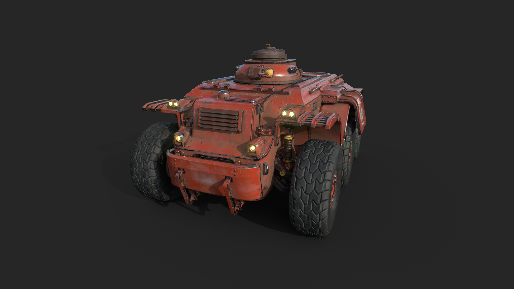

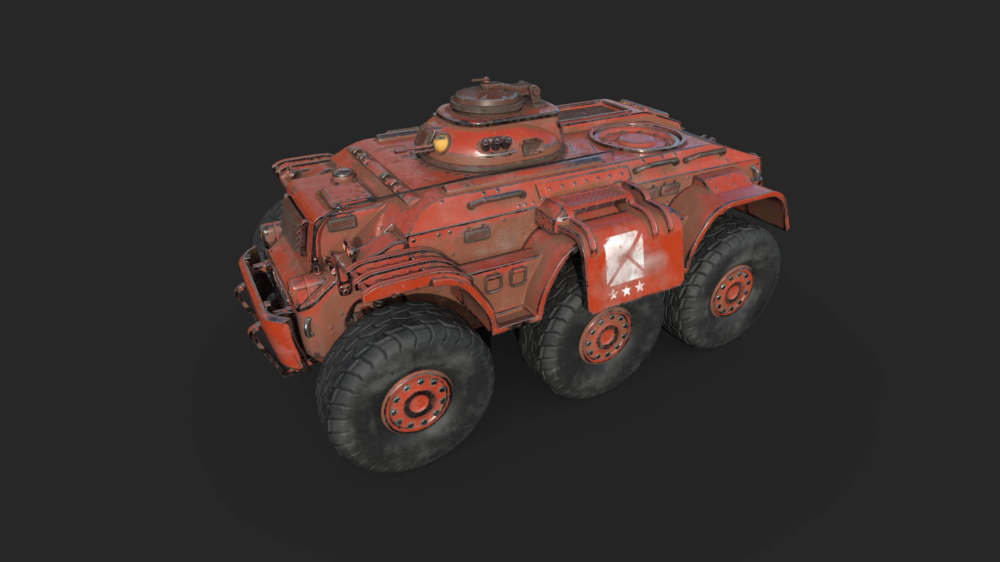

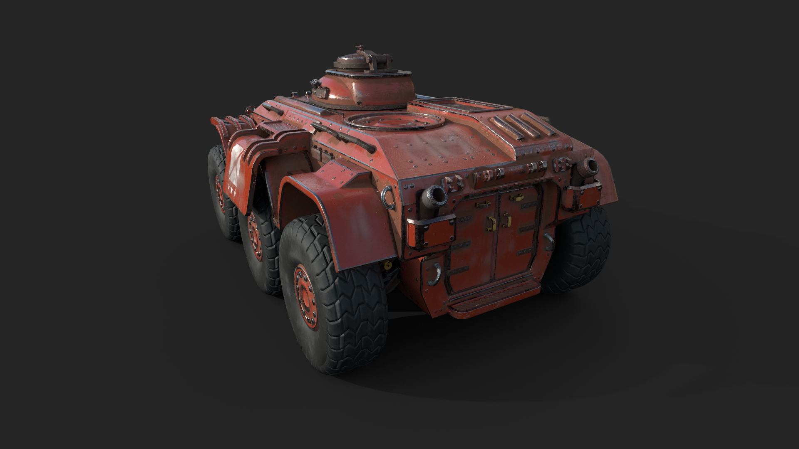

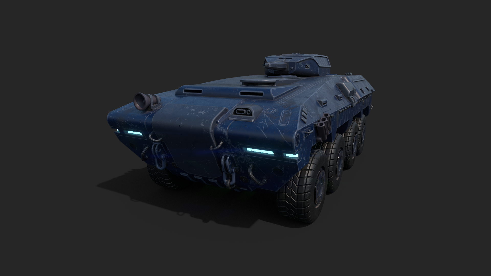

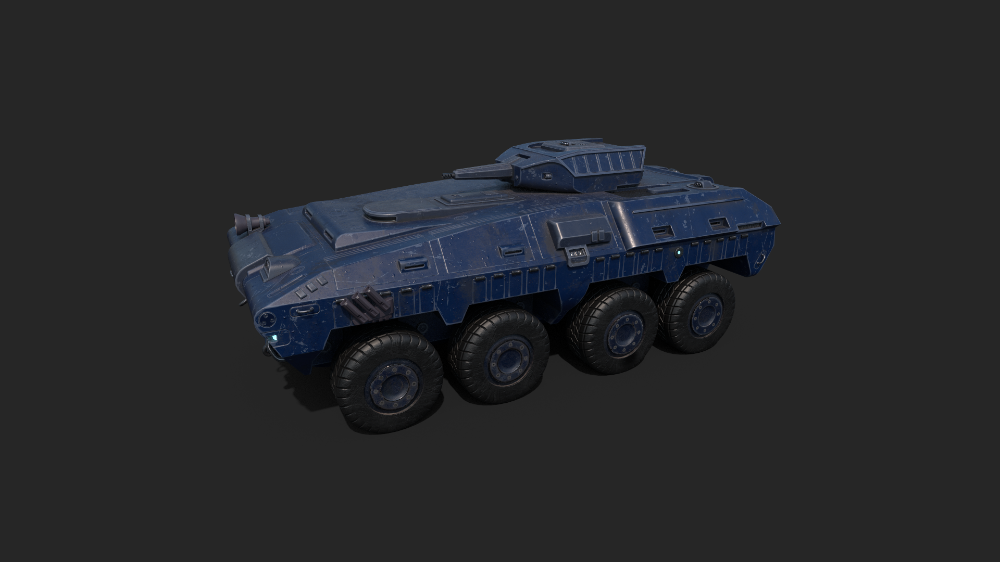

The colours aren't set in stone and we still experiment with different colours and colour palettes but I have to say that NF stuff looks really good in those bright aggressive colours. Here are some colour variations:

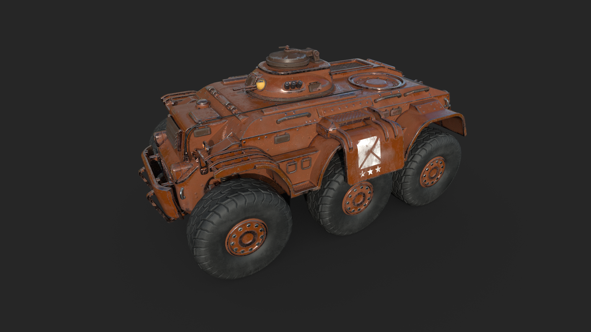

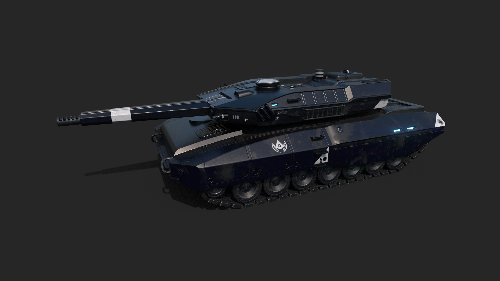

That's all. I'm on a 3 week vacation next month so I do not think I can model anything in August. See you in September :) . 

Here is a short video of Megafunk playing around with the tank in the engine.

 <video controls>
  <source src="https://i.imgur.com/8gqgNCU.mp4" type="video/mp4">
  Your browser does not support the video tag.
</video> 

Oh… well another week went by and the July update got delayed. I made some new BE guns at that time.

 _Editor's Note: Some of us have jobs :P_

I am trying out something different with the BE guns right now. More bulky, techy looking guns. The general idea is that BE mass produces its guns with cheap and fast metal stamping and 3D printing techniques. Only special forces get the well crafted good stuff, like for example the scout rifle. The mass produced weapons also share parts between each other. It's a fast and effective way (to model) to produce guns for the battlefield.

Brenodi standard issue rifle.

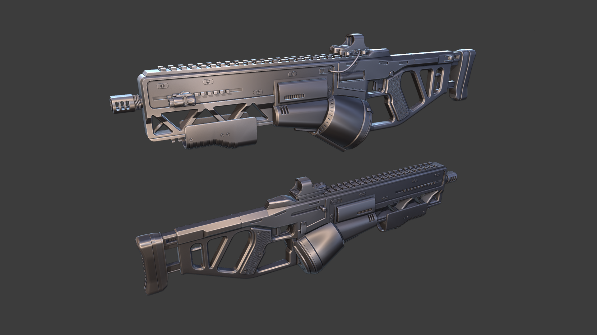

Brenodi heavy rifle.

Brenodi light SMG.

Brenodi heavy SMG.

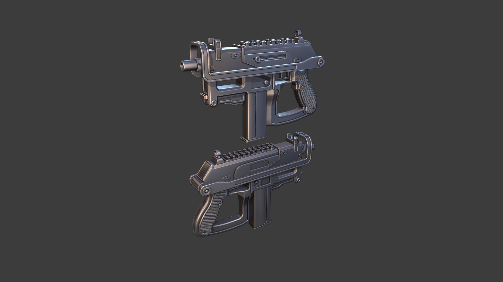

Brenodi machine pistol.
