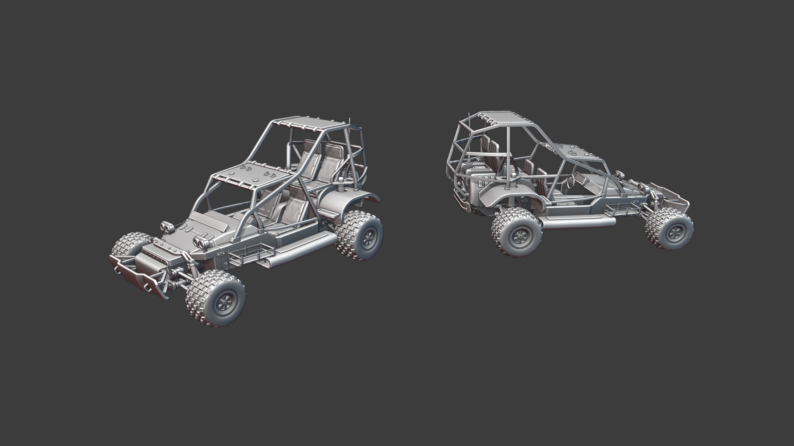

## Vehicle Models

###### Mayama

I managed to make all the remaining NF vehicle models. As always, no micro details like rivets & bolts and stuff, I add that when we are 100% sure that we do not alter the model in any way. Oh and suspension + steering this time because, let's be honest, it looks kinda dump without it.

The new NF Jeep. I tried to make something somewhere between a realistic military buggy and mad max (without the spikes). It's bigger than the source Empires jeep but if you want to make something that's more than a box with 4 wheels you need more space.

The APC model. In source empires the only NF models with 6 or more big wheels were the CV and the light tank. I wanted to bridge the gap between the LT and the rest of the normal vehicles. The design goal was to make something that's a mix between the LT design and the rest of the tanks. The old NF APC was basically just a minivan with random stuff bolted to it. I wanted to make an APC model that looks like it can actually take a beating. 

The new “arty”. It's in quotation marks because the idea behind it is that you can switch out the turrets so we can later just add an anti aircraft turret or whatever to it instead of making a whole new model. I made it look like a heavy duty truck or tractor that NF repurposed for war and bolted a platform on its back. It's not a frontline vehicle that's why it's not as armored as the rest of the units.

The NF medium tank. I tried a lot of stuff that is closer to the ww1 design of the source empires models but you either get something that's (like in source empires) way too big or looks like a goofy box with tracks. So after playing around with it a bit I decided to make them look more ww2’ish. The general NF “design” of having a million things bolted to the body stayed though. It's roughly the same size as the BE medium I posted last update, a bit higher but shorter.

The NF heavy tank. It's really big, like I said in my last update. We want to make heavies special and not common on the battlefield. Players should be scared when they see a heavy tank. The dual rocket launcher is integrated into the body and the hole on the front plate is where the rocket exits the turret. It has two tank tracks on each side to support its massive weight.

The NF command vehicle. The rolling base of the NF operation. I wanted to design something that looks a bit meaner than the kinda goofy source empires NF CV. It has 3 hydraulic feet on each side that extend when the commander is in command view. It does not alter gameplay, the intention is to tell enemies when the commander is actually driving the CV and when it's safe to approach the vehicle. Two things on the vehicle represent features that might get implemented after 1.0. The 6 launchers can launch small drones that repair and build stuff in a small radius around the CV. The turret is an anti aircraft gun because the CV might need some form of defense against aircrafts or else a single plane could hunt the CV all over the map.

Finally a few pictures to compare the size of the vehicles:



## ECS Bullets - Overview

###### Megafunk

In our last update, we briefly mentioned making a high performance “ECS Bullets” system. It’s really coming along so I’ll go into more detail about what I made. 

In Unreal Engine 4 if you look around at existing solutions to create a projectile simulation the presiding wisdom is to create an Unreal Engine “Actor” object for every bullet fired with simulation code attached. Using Actors works well enough for the majority of games because their problems don’t really emerge until you have to simulate hundreds of things per frame. 

There are many tricks to fight actor ticking performance issues. Most of them include reusing actors when spawning or creating a manager that ticks actors in groups or only every few frames. Those all help a bit but the core of the problem is that UE4 actors are still just plain expensive to tick and move. Why are they so slow? The short answer is that the cost of moving memory in and out of the cpu is much slower than any of the simulation work your code actually does. UE4’s gameplay framework is very “Object Oriented” which means they use a giant hierarchy of classes to express what’s what. When things tick, the CPU needs to spend extra time looking for instructions and data which are stored in memory pretty much randomly.

To make code that doesn’t have this problem we have to think in a “Data Oriented” way. That means thinking about how we store our memory (both data and instructions) and making sure the cpu always has what it needs close by. Long story short, having arrays of simple data that you operate on all at once makes this very easy. That’s what an Entity Component System does! We use a 3rd party one written in C called FLECS. It’s a tool that makes it easy to pair giant arrays of data with simulation code. Here’s a quick rundown:

 

Entity: a unique ID that can have components

Component: just raw data (Position, Velocity etc)

System: a query for a specific set of components to manipulate with instructions

You make an entity with components and the ECS automatically sends it to matching systems to tell them what to do. So, for example our bullets could just have a Position, Velocity and BulletType. A system to move every bullet forward could just accept Position and Velocity to push the position forward by the velocity. The cool part here is twofold, it’s both simple to reason about and great for CPU performance. 

Currently bullets work by raycasting their path through the air every frame until they hit something. These raycasts are the same used internally for UE4’s physics and are cheap to do en masse. We can even easily multithread this because the work is very self-contained by components on the entity. 

Now, how to make UE4 render them? In UE4 particle systems in the world need to be actors themselves so it would defeat the purpose to have one for each bullet. I chose to create a particle “manager” system that’s a single particle system that can represent thousands of bullets at once. A FLECS system queries bullets that are paired with a “particle manager” entity and makes an array of position values that it feeds into it every frame. 

The resulting performance is magnitudes faster than the “normal” method of doing bullets both in spawning time and simulation ticking speed. I doubt a game of Empires will ever have 30,000 bullets flying around at once, but with this we have a fair bit more leeway in our frame budget.

## ECS Bullets - Networking

###### Roy Awesome

I’ve been working quite a bit on networking ECS bullets so that every player can see them.  This turned out to be a rather massive rabbit hole into the UE networking stack, and I’ve built a pretty cool system to generally replicate bullets to clients. 

Unreal Engine has a systel called “Data Channel”, which can form network packets and send them to clients.  Creating one of these is quite involved and took quite a while to accomplish, but now I can just send ECS entities and bullets to clients.  I’ve also considered methods of predicting bullets, by creating entities on the client and sending a key to the server, which sends it back with the server authoritative bullet.  

Over the next month, I plan on finalizing the netcode for bullets, and then integrating these bullets into our shooting abilities.  

## ECS Bullets - Open Source

###### Roy Awesome

Empires Unreal project has benefited greatly from the Open Source community surrounding Unreal Engine, with many different open source projects contributing to our development.  In an effort to give back to the greater community and to grow our profile a bit, we’ve decided to Open Source the ECS Bullets plugin under the MIT license.  

[https://github.com/EmpiresCommunity/ECSProjectiles](https://github.com/EmpiresCommunity/ECSProjectiles)

This likely will not be the last part of Empires-Unreal that we open source, as we care a lot about the open source community and are extremely proud to contribute to it.  
