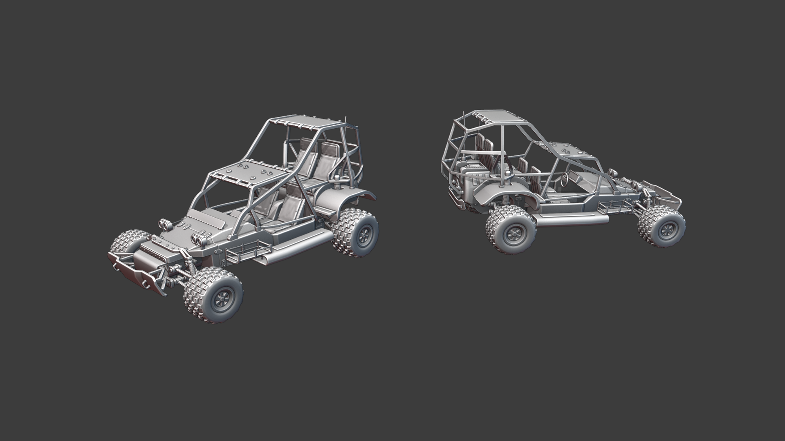
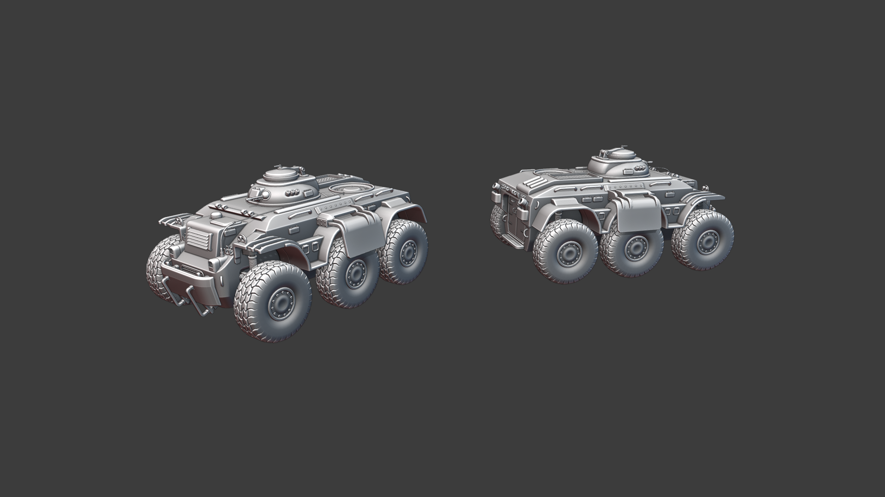
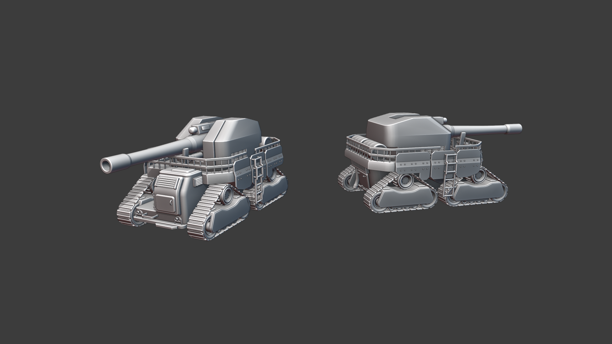
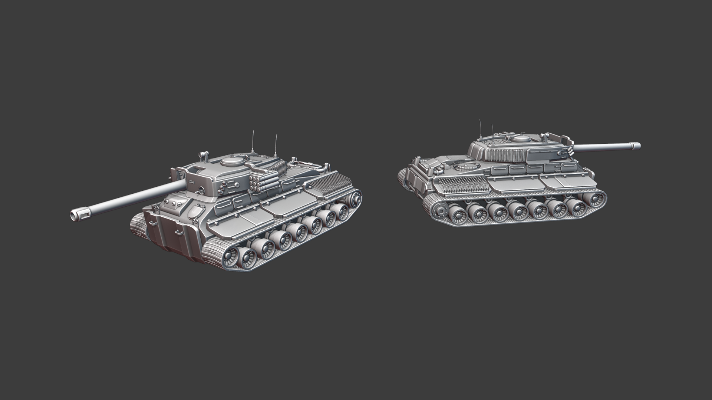
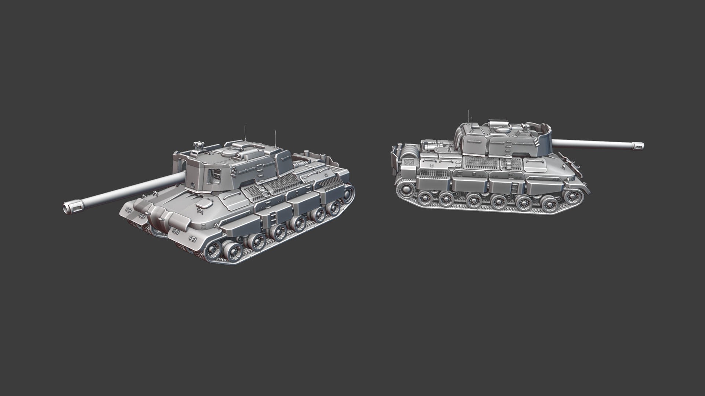
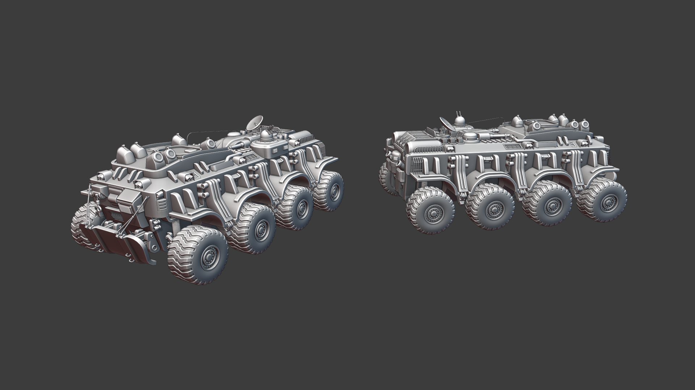

## Модели техники

###### Mayama

Мне удалось сделать все оставшиеся модели техники СФ. Как всегда, без микро-деталей по типу заклёпок, болтов и прочего, я добавлю их, когда мы на 100% будем уверены, что модель мы не поменяем. А ещё с подвеской и рулём в этот раз, потому что, давайте будем честны, без этого он выглядит как корыто.

Новый джип СФ. Я хотел сделать что-то среднее между реалистичным военным багги и Mad Max (без шипов). Он массивнее, чем джип из Source Empires, но если вы хотите сделать что-то лучше коробки с 4-мя колесами, вам нужно больше места.

Модель БТРа. В Source версии единственными моделями СФ с 6-ю колёсами были командирская машина и лёгкий танк. Мне хотелось преодолеть разрыв между ЛТ и остальной обычной техникой. Цель дизайна состояла в том, чтобы создать нечто среднее между дизайном ЛТ и остальными танками. Старый БТР СФ был по сути просто минивэном к которому привинтили случайные штуки. Я хотел создать модель БТР, которая выглядела бы так, будто ее в самом деле можно победить. 

Новая “Артиллерия”. В кавычках, потому что идея заключается в том, что вы можете снять башню и поставить на её место зенитную или любую другую, так нам не придётся создавать отдельную модель для зенитки. Я сделал его похожим на тяжелый грузовик или трактор, что СФ переделали для войны, и прикрепили платформу взади. Это не фронтовая машина, поэтому она не такая бронированная, как остальные.

Средний танк СФ. Я перепробовал множество вещей, что были ближе к дизайну Первой Мировой из моделей Source Empires, но вы либо получаете что-то слишком большое (как в Source Empires), либо оно выглядит как чёртова коробка с гусеницами. Поэтому, немного пошибуршив с этим, я выбрал дизайн ближе к Второй Мировой. Не смотря на это, общий “дизайн” СФ, заключающийся в том, что к чему-то лепят миллион вещей, остался. Он примерно того же размера, что и СТ БЕ, который я показывал в последнем обновлении, но немного выше и короче.

Тяжёлый танк СФ. Он очень большой, как я и говорил в своем последнем обновлении. Мы хотим сделать тяжей особенными, необычными, редкими на поле боя. Игроки должны бояться при виде тяжёлого танка. Двойная ракетная установка встроена в корпус, а отверстие на переднем щитке - это место, откуда ракета вылетает из башни. У него по два трака на сторону для поддержки его внушительного веса.

Командирская машина (КМ) СФ . Передвижная база миссии СФ . Мне хотелось создать что-то выглядящее более зловеще, чем бестолковая КМ СФ из Source Empires. Она имеет 3 гидравлических ножки с каждой стороны, которые выдвигаются, когда командир находится в режиме RTS. Это не меняет игровой процесс, цель такова, чтобы дать знать врагам, когда командир на самом деле управляет КМ и когда можно безопасно приближаться к машине. На машине есть две вещи представляющие функции, которые могут быть реализованы после 1.0. 6 пусковых установок с дронами, что могут ремонтировать и строить в небольшом радиусе вокруг КМ. Маленькая башня является зенитной пушкой, она служит средством ПВО для КМ, иначе один единственный самолет мог бы охотиться за КМ по всей карте.

И наконец, пара картинок для сравнения габаритов:



## ECS Bullets - Обзор

###### Megafunk

В нашем последнем обновлении мы кратко упомянули о создании высокопроизводительной системы “ECS Bullets”. Мы в самом деле занимаемся этим, поэтому я расскажу более подробно о том, что уже готово.

В Unreal Engine 4, если вы рассмотрите существующие решения для симулирования снаряда то обнаружите основную мудрость, она состоит в том, чтобы создать объект “Actor” Unreal Engine для каждой выпущенной пули с прикрепленным кодом симулирования. Использование Actor'ов работает достаточно хорошо для большинства игр, потому что их проблемы на самом деле не возникают до тех пор, пока вам не придется симулировать сотни вещей за кадр. 

Существует множество трюков для борьбы с проблемами производительности Actor'а. Большинство из них включают повторное использование actor'ов при спавне или создании менеджера, который помечает actor'ов в группах или только каждые несколько кадров. Все это немного помогает, но суть проблемы в том, что Actor'ы UE4 по-прежнему просто затратно отмечать и перемещать. Почему они такие медленные? Короткий ответ заключается в том, что стоимость перемещения памяти в процессор и из него намного выше, чем любая работа по симуляции, которую фактически выполняет ваш код. Система UE4 gameplay framework очень “объектно-ориентирована”, что означает, что она использует огромную иерархию классов, чтобы выразить, что есть что. Когда все идет своим чередом, процессору приходится тратить дополнительное время на поиск инструкций и данных, которые хранятся в памяти в значительной степени случайным образом.

Чтобы создать код без этой проблемы, мы должны мыслить “ориентированно на данные". Это значит, что мы должны подумать о том, как мы храним нашу память (как данные, так и инструкции), и убедиться, что процессор всегда имеет под рукой то, что ему нужно. Короче говоря, наличие массивов простых данных, с которыми вы работаете одновременно, делает это очень простым. Это и делает Entity Component System! Мы используем стороннюю программу, написанную на C, под названием FLECS. Это инструмент позволяет легко сопоставлять гигантские массивы данных с кодом симуляции. Вот краткое изложение:

 

Entity: уникальный ID, который может содержать компоненты

Component: просто сырые данные (Position, Velocity и т.д.)

System: запрос для определенного набора компонентов для работы с инструкциями

Вы создаете Энтити с компонентами, и ECS автоматически отправляет его в соответствующие системы, чтобы сообщить им, что делать. Так, например, наши пули могут просто иметь Position, Velocity и BulletType. Система для перемещения каждой пули вперед может просто принимать Position и Velocity, чтобы продвинуть Position вперед c помощью Velocity. У нас есть выходит 2-е интересные вещи: об этом просто рассуждать, и это отлично подходит для производительности процессора. 

Сейчас пули работают через Raycast, просчитывая свой путь в воздухе каждый кадр, пока не попадут во что-нибудь. Эти Raycast'ы являются теми же самыми, что используются внутри для физики UE4, и их дешево делать в массовом количестве. Мы даже можем легко сделать это дело мультипоточным, поскольку работа довольно самодостаточна по компонентам энтити. 

Ну а теперь, как заставить UE4 рендерить их? В мире UE4 particle system должны быть сами actor'ы, поэтому было бы неправильно иметь по одному для каждой пули. Я решил создать систему “менеджера” частиц, которая представляет собой одну particle system, которая может поддерживать тысячи пуль одновременно. Система FLECS запрашивает пули, что соединены с энтити “менеджера” частиц, и создает массив значений позиций, которые она заносит в “менеджер” каждый кадр. 

В результате производительность на порядок выше, чем при “обычном” методе создания пуль, как по времени спавна, так и по скорости симулирования. Я сомневаюсь, что в Empires когда-либо будет летать 30 000 пуль одновременно, но с этим у нас будет несколько больше свободы в нашем бюджете кадров.

## ECS Bullets - Нетворкинг

###### Roy Awesome

Я довольно много работал над нетворкингом ECS Bullets, чтобы каждый игрок мог их видеть. Это оказалось довольно массивной кроличьей норой в стеке нетворкинга UE, и я построил довольно классную систему для обыкновенной репликации пуль клиентам.

В Unreal Engine есть система под названием “Data Channel”, которая может формировать сетевые пакеты и отправлять их клиентам. Создание одного из них довольно сложно и заняло довольно много времени, но теперь я могу просто отправлять энтити ECS и пули клиентам. Я также рассмотрел методы прогнозирования пуль, создавая энтити на клиенте и отправляя ключ на сервер, который отправляет его обратно с пулей, подтверждающей полномочия сервера.  

В течение следующего месяца я планирую доработать сетевой код для пуль, а затем интегрировать эти пули в наши возможности стрельбы.  

## ECS Bullets - Open Source

###### Roy Awesome

Проект Empires Unreal получил большую пользу от Open Source сообщества, окружающего Unreal Engine, и множество различных Open Source проектов внесли свой вклад в наше развитие. В попытке нарастить сообщество и немного расширить наш профиль, мы решили открыть исходный код плагина ECS Bullets под лицензией MIT.  

[https://github.com/EmpiresCommunity/ECSProjectiles](https://github.com/EmpiresCommunity/ECSProjectiles)

Скорее всего, это будет не последний раз для Empires-Unreal, когда мы открываем исходный код, так как мы очень заботимся о Open Source сообществе и очень гордимся тем, что вносим в него свой вклад.