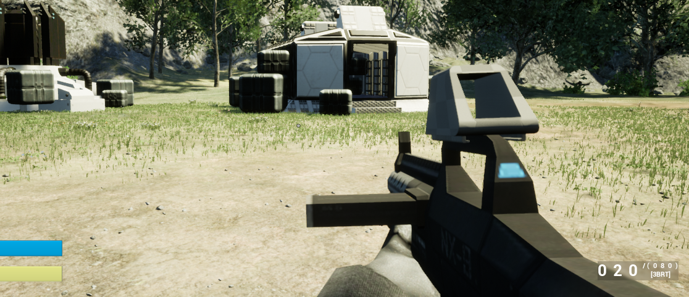
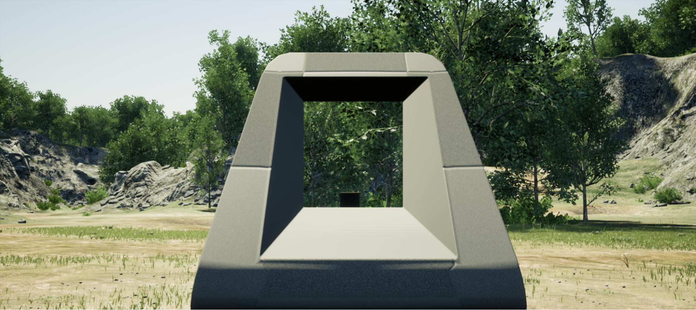
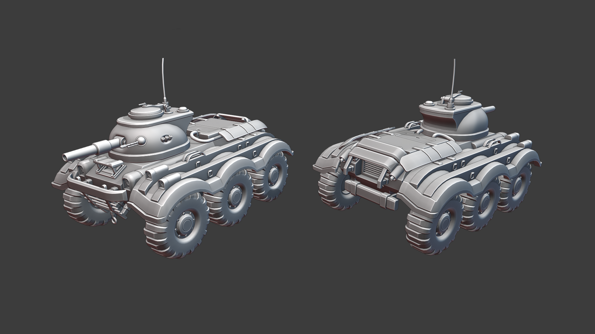
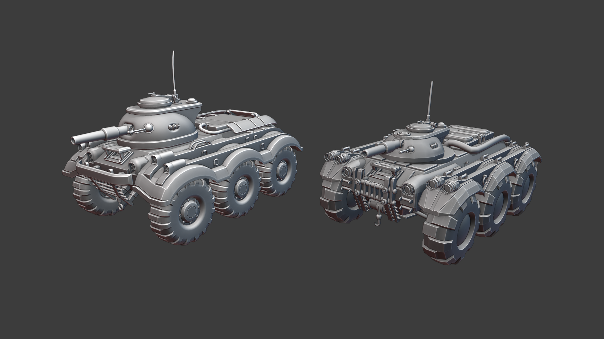
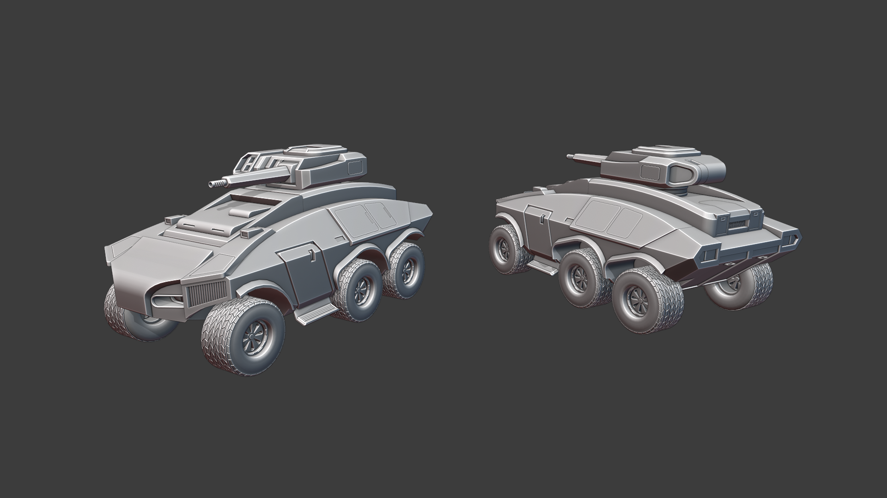
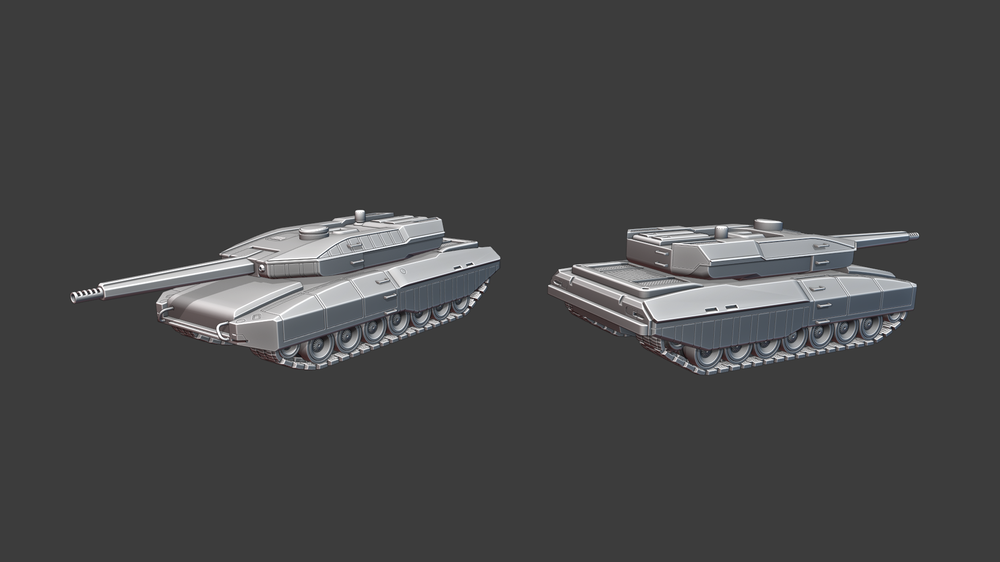
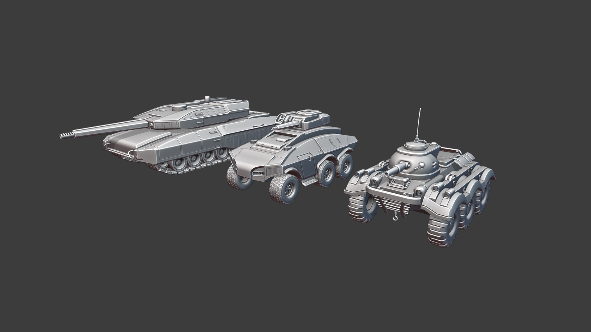
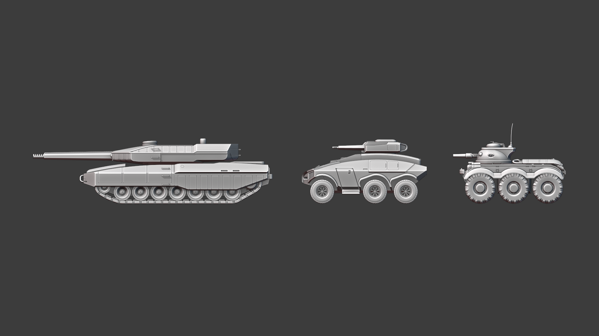

## Unreal Engine 5

###### Roy Awesome

Unreal Engine 5 came out this month, surprising just about everyone.  Initial observations show that it’s as monumental of a leap forward as Epic was promising, which is a good sign.  I spent some time this month evaluating the new features in UE5 and what kind of work it would take to port what we’ve done with Empires in UE4 to UE5.  The short answer is: not a whole lot of work needed, and we could port soon if we wanted.  The most significant changes in UE5 were to the rendering pipeline, and it’s a part of the engine we have not touched at all.  Because we’ve made no customizations or changes there, all of our content can port trivially to UE5.  The Gameplay Framework has changed, but the current UE4 framework still exists, which means we can just use the UE4-style code until we port over to the new modular features.  

The main features we look to take advantage of in UE5 are the new Modular Gameplay framework, the new World Partition features, and Deterministic Chaos Physics.  

Modular Gameplay allows us to structure game content in a way that only assets that are needed are loaded, and allows us to swap out huge swaths of features depending on what the game needs at the time.  For example, if we split up our factions into Modular Gameplay Plugins, with BE in one plugin and NF in another, we can have BE vs BE matches where the NF content just isn’t loaded at all.  Maybe in the future we can add additional factions, loading them on demand.  Additionally, Modular Gameplay plugins can be loaded at runtime, meaning we can fully support mods that add new maps, factions, vehicles, guns… all kinds of stuff.  You’ll be able to join a modded server, download the mods, activate them, and hop into gameplay all without leaving the game.  When you are done, leaving the server will unload the modular gameplay plugins, allowing you to switch to another server with different mods seamlessly.  This basically turns huge chunks of our game into built in mods, allowing us to quickly update things, experiment with new features, or even for modders to just replace that portion of the game with their own code or content.  It’s extremely exciting and powerful, and something that will give Empires extremely long legs.

World Partition allows us to create many layers in a single map, and overlay the layers as needed.  We already have a world streaming setup to accomplish this strategy, but the UE5 features allow us to do some incredibly powerful things.  We can create a layer of M_Valley that has a fully intact dam, and a layer with the dam destroyed and the valley flooded.  We can create a transition effect so that if you deal too much damage to the dam it cracks and breaks, flooding the map.  Only the parts of the map that are visible are loaded (and if we transition between layers, the new layer is streamed in quickly), and we can create any number of states the map can be in, add playable space, change lighting, and add gameplay layers however we want.  It’s a brand new paradigm for map making, and it’s all very exciting.

Chaos Physics is for vehicles, and will finally allow us to predict vehicle movement on the client and replicate it exactly to all other clients.  This means that any force that pushes against a vehicle will create the exact same simulation on all clients, without jank.  This is extremely important for our vehicle gameplay, and even enables aircraft.  

The main thing holding us back is the fact that many of the plugins we rely on for Unreal Engine haven’t updated yet.   We’ll probably port when they update.  

I did want to note, we will probably also take advantage of the two big rendering changes, Nanite and Lumen, but not immediately.  Nanite is viable, as it has a relatively low rendering cost for billions of triangles, even on older hardware.  Lumen, however, is a very expensive technique that my computer cannot run quite yet.  Odds are, we’ll use Nanite sooner rather than later, and Lumen will be an optional “make my game look amazing” feature for those that have beastly computers that can run it.  

## Aim Down Sights

###### Roy Awesome

Aim Down Sights was my main project this last month.  The goal was to create an Aim Down Sights system that doesn’t require importing or tuning animations in blender to get working, and using game data and Inverse Kinematics to drive everything.

This was a surprisingly difficult task.  I’m not a very good animation programmer and the tech I was using doesn’t have many good resources on the internet.  However, I pushed through and managed to figure it out.  What we do is calculate where the center of the camera would be in relation to the sight we are aiming toward, and then move the gun to that spot.  From there, we IK the hands into the right locations given the new gun position, and it looks pretty good.  We have full control over how fast or slow you aim in, and right now it’s more in line with modern first person shooters.  

Because we needed Sights to aim down, I then designed out an entire attachment/sight system.  We have 3 types of sights, AimPoint sights, where you only have one sight model to look through (like an aimpoint scope or reflex sight); Front Post sights, where we anchor the weapon’s view point to the front post of the sight, which is used for Iron Sights; and Overlay Sights, where we hide the gun and draw a full screen overlay over the camera, which we used for sniper scopes.  This basically covers the entire gamut of sights we will ever need, including things like Night Vision or Thermal sights if we ever do those (they are just Overlay sights).  It’s an extremely flexible system, and while it won't be configurable for the initial release, having these options available will lead to creating a far more interesting and dynamic infantry combat game.  

 <video controls>
  <source src="https://cdn.discordapp.com/attachments/698655659193008208/847371277936099388/2021-05-27_00-10-19.mp4" type="video/mp4">
  Your browser does not support the video tag.
</video> 

## Vehicle Design

###### Mayama

So because with the release of U5 in the near future there was a lot to discuss about how we approach models and what we can use or change to make it look better and easier to implement. That means I had some “free time” doing other stuff. I spend some time designing vehicles for both factions. All models I show here are not finished, they lack small details like rivets and armour platings. I didn't add suspension because we do not 100% know how we want to implement it and it would be wasted modeling time to design it if we might do it in a different way.

That's my interpretation of the NF light tank, it's an iconic design and more or less the mascot of the game. That's why I didn't want to completely change the model and just updated it.

As you can see the new version is a bit taller with a higher turret. The original turret was really weird and there was no way a human could actually crawl through it. The higher profile might also fix some balance issues with the LT which is a bonus.

The new Brenodi armoured fighting vehicle. The old one was more or less a block with a turret. For me BE should have way more aggressive looking vehicles that fit their near future oppressive world power theme. The design is a mix of the stealth fighter look, think of a F-117 and 80's italian car design (bonus points for whoever gets what company I “lend” most of my design ideas from). A shape like that would also even the playing field between the NF LT and BE.

My interpretation of the BE medium tank. I have to admit that I never liked the original design because it's just a leopard II tank with less detail (and shrinked down). The problem was that it is, beside the NF LT, the most liked source empires vehicle so I tried to upgrade the design and not make a completely new one. I gave it the same curved angular look that the new BE LT has. It's still a bit “leopardish” looking but it has its own character now.

Two pictures so you can roughly see how big those vehicles are compared to each other. The perspective is a bit misleading but the NF LT is a bit broader but not as long as the BE counterpart.

The BE medium tank is a lot bigger than in source empires.The reason for it is that we want to establish medium tanks as the main battle tank and make heavies specialized vehicles that you won't see constantly on the battlefield, basically how empires is playing currently anyway.

## ECS Bullets

###### RoyAwesome

At the end of this month, I started working on ECS Bullets.  This is a big technical win for us, and allows us to have tens of thousands of bullets simulating at the same time without lag or performance concerns.  We have it mostly working already, but only in a single player context.  I am working on getting bullets simulating over the network and communicating with clients, and then I’ll implement a solid projectile simulation we can use for all guns.  
